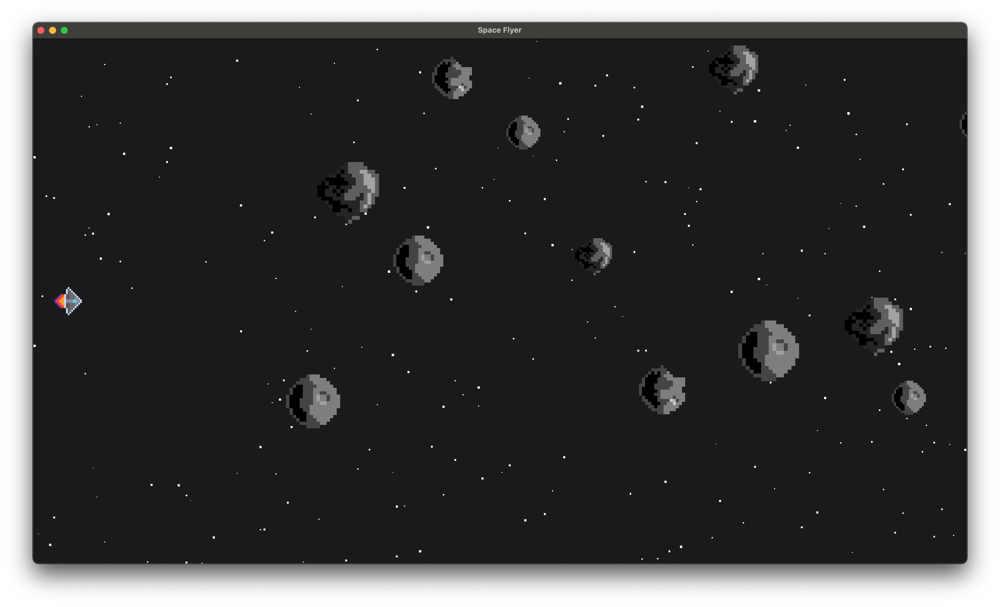

# Space Flyer
Space flying game built using the [Bevy Game Engine](https://bevyengine.org/).

## Gameplay


## How to run
Download and install Rust!
https://www.rust-lang.org/tools/install

Compile and run the game with:
```rust
cargo run
```

*This will take some time as you are essentially building an engine from scratch. You will only need to do a full rebuild once. Every build after this one will be fast!*
